[Volver](README.md)

- [1. Cliente de desarrollo](#1-cliente-de-desarrollo)
    - [1.1 Navegadores](#11-navegadores)
    - [1.2 MobaXterm](#12-MobaXterm)
    - [1.3 Netbeans](#13-netbeans)
        - [Creación de proyecto](#creacion-de-proyecto)
        - [Versonamiento de un proyecto](#versionamiento-de-un-proyecto)

## 1. Cliente de desarrollo
### 1.1 Navegadores
Aquí se especifican los navegadores que solemos utilizar para la interpretación y visualización de
nuestras aplicaciones web. También se indican las extensiones instaladas en cada uno.

> **Navegadores y extensiones**\
> Edge: Color Picker - Native Eyedropper\
> Chrome: ColorZilla

### 1.2 MobaXterm
Esta aplicación permite conectarse a un servidor mediante un amplio abanico de protocolos.
En nuestro caso, los dos protocolos que vamos a utilizar son SFTP para la gestión de archivos y 
directorios del servidor apache y SSH para realizar cambios en los ficheros de configuración.

> **Versión**: MobaXterm Personal Edition v25.2 Build 5296

Una vez descargada e instalada la versión siguiendo los pasos (en clase tenemos la versión portable),
iniciamos la aplicación.
Para conectar un dispositivo por SSH debemos realizar los siguientes pasos:
> Pulsamos el botón Session con una pantalla como símbolo.

||

> Seleccionamos SSH como protocolo de conexión.

|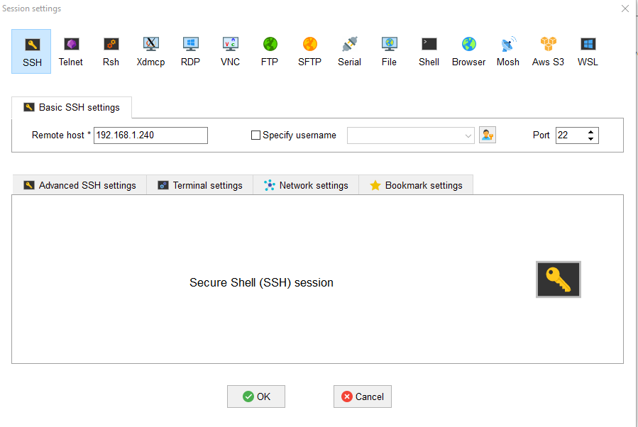|

> Introducimos en el apartado Remote host la IP del ordenador al que queremos conectarnos. También 
se puede especificar al usuario al que queremos conectarnos en el apartado Specify username, pero no 
es obligatorio.

||

> Se nos abrirá un terminal donde iniciaremos sesión con un usuario y una contraseña valida.

|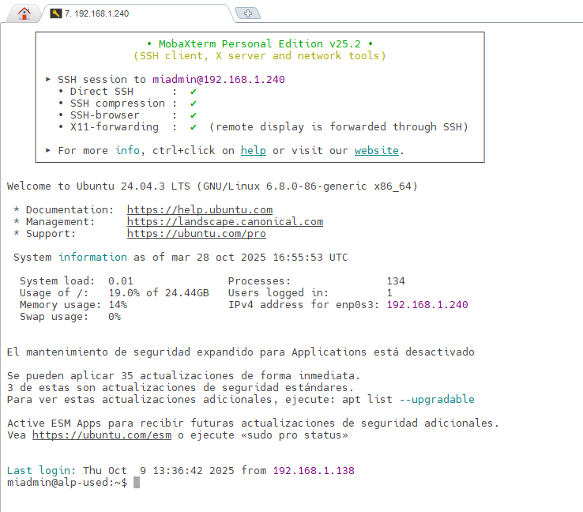|
Para conectar un dispositovo por SFTP para la transferencia de datos debemos realizar los siguientes pasos:

> Pulsamos el botón Session con una pantalla como símbolo.

||

> Seleccionamos SFTP como protocolo de conexión

|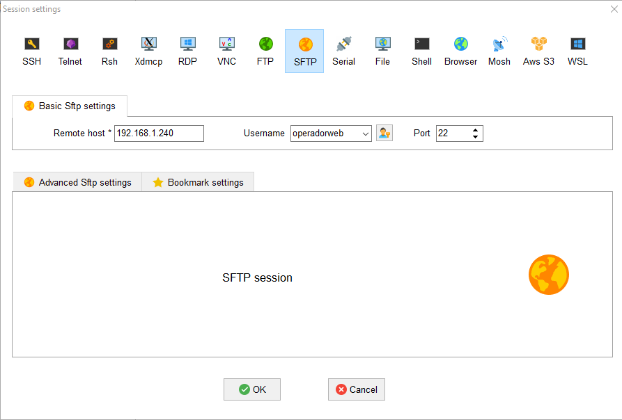|

> Introducimos la IP del ordenador al que queremos conectarnos en el apartado "Remote hosts" y, esta vez,
si debemos especificar el usuario al que queremos conectarnos en el apartado "Username". Para nosotros es "operadorweb".

|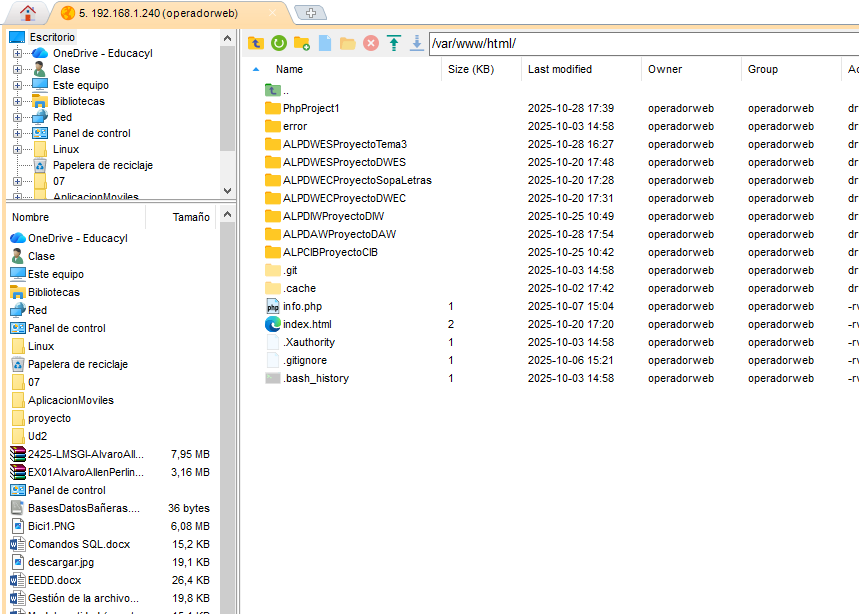|

> Comprobamos que nos encontramos en el directorio raiz /var/www/html y que podemos crear carpetas y archivos, modificarlos y eliminarlos.
### 1.3 Netbeans
Como nuestro IDE escogido para el desarrollo de aplicaciones web durante el segundo curso de DAW es NetBeans
vamos a introducir este programa.
De uso completamente gratuito y con una interfaz compleja pero bastante completa tenemos delante un IDE estupendo pero complicado 
en un principio.

#### Creación de proyecto
En este apartado vamos a detallar como se crea un proyecto de PHP enlazado mediante SFTP a un servidor de Ubuntu. La configuración
de dicho servidor está explicada en este mismo documento.
Para crear debemos de pulsar el botón con un cuadrado amarillo y un + verde.

|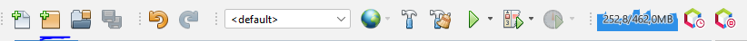|

Esto nos abrirá una pestaña como la de abajo donde podemos escoger el tipo de proyecto entre un catálogo extenso:

|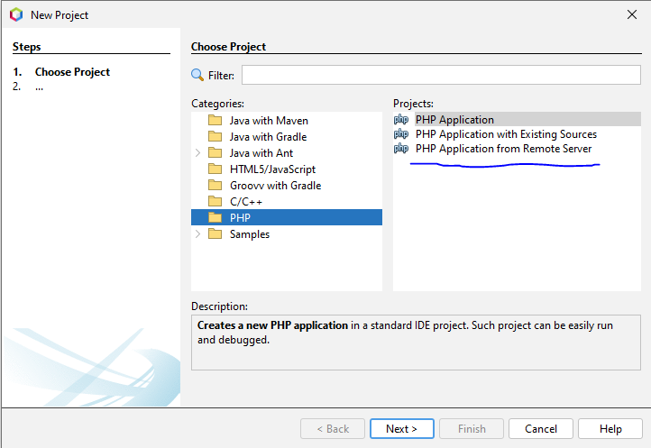|

Escogemos el proyecto PHP y se nos abre la ventana de configuración de conexión donde pondremos la url completa de nuestro proyecto y 
donde se guardará. Antes de continuar deberemos de darle a Manage y establecer la conexión

|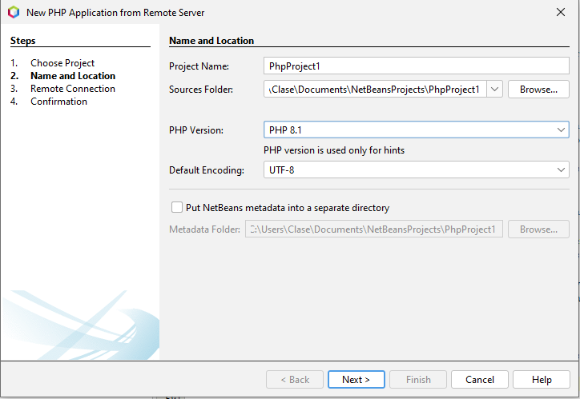|

**Pestaña de conexión**
En esta pestaña indicaremos la ip de nuestro servidor Ubuntu, el usuario con el que iniciaremos la conexión y su contraseña que en este caso
es el usuario operadorweb e indicaremos la ruta donde se encuentra el proyecto en cuestion teniendo en cuenta que los proyectos se alojan en
/var/www/html...

|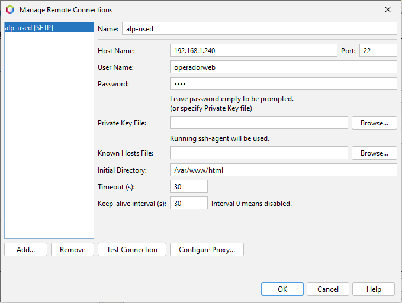|

Para terminar pulsaremos el botón de Test Connection para probar si la conexión se realiza correctamente y cerraremos la pestaña.

||

Al terminar de configurar la conexión y en caso de haber salido bien, nos saldrá un cuadro donde nos muestra la carpeta del proyecto previamente
creada en el servidor y dentro un archivo cualquiera también creado con anterioridad. Esto es muy importante ya que, en caso de no existir la carpeta
o de estar vacía, la conexión nos lleva a errores como creación de archivos basura o creación de directorios donde no deberían de crearse.

|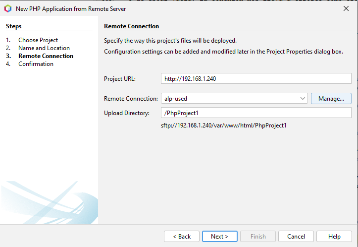|
|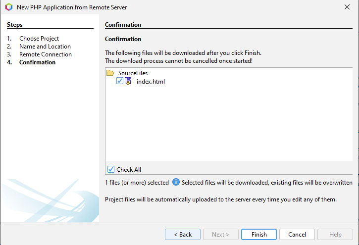|

**Pestaña de sincronización**
Al finalizar podremos gestionar nuestra conexión pulsando click derecho en la carpeta sources y dandole a syncronize. Importante tener cuidado ya que 
la pestaña de sincronización nos permite borrar, descargar y subir archivos y NetBeans establece bajo su criterio que elementos borrar, cuales subir y cuales 
descargar y suele confundirse. Tener máximo cuidado y, en caso de duda, poner a todos los archivos la opción suspense la cual ignora el archivo.

|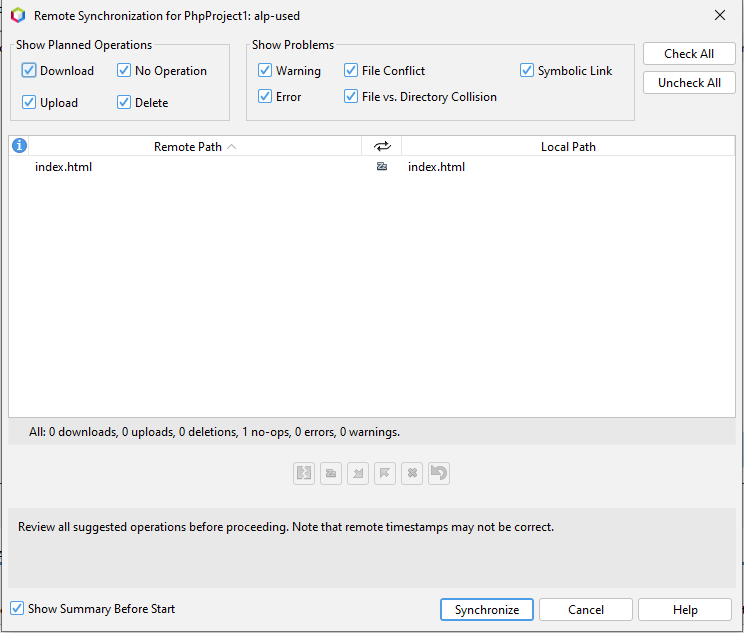|

#### Versionamiento de un proyecto
Una vez creado el proyecto, lo siguiente es versionar y hacer el primer commit. Para ello haremos click derecho encima del proyecto y pulsaremos 
Versioning>Initialize Repository. Automaticamente se nos pondrán en verde todos los archivos y tendremos que hacer un commit.

|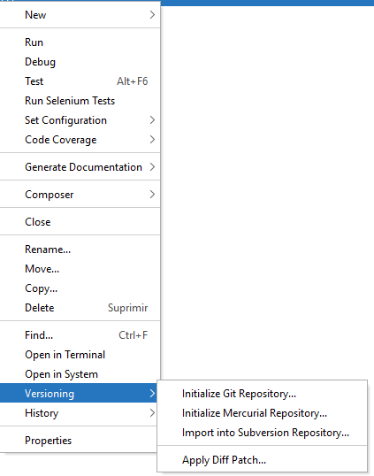|

|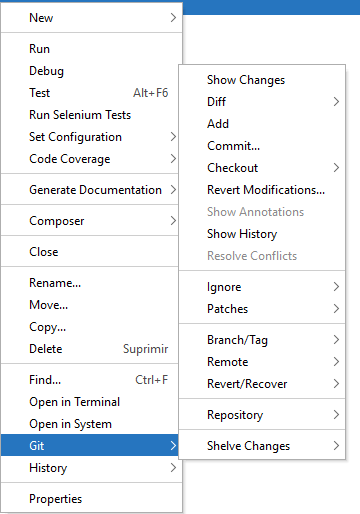|

Por defecto la rama creada es la master y con ella haremos el commit pulsando botón derecho sobre el proyecto Git>Commit y nos saldrá la siguiente ventana:

||
|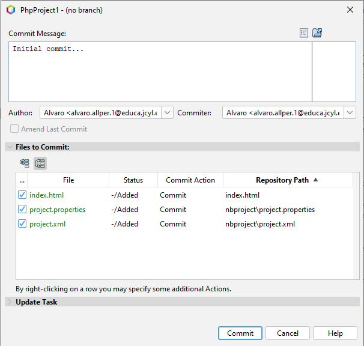|

El mensaje recomendado para el primer commit es: Commit inicial o Initial commit. 

||

Con esto podemos dar por terminado este apartado pero podemos añadir ramas cuyo uso facilita y simplifica el desarrollo.
Tener una rama developer donde desarrolles y pruebes cosas nuevas y otra master donde subas el producto terminado hace más limpio
el desarrollo de tu aplicación.
Para crear una rama debemos hacer click derecho en el proyecto Git>Branch/Tag>Create Branch. Se nos abrirá una ventana
en la cual escribiremos el nombre que queremos para la rama y aceptaremos.

|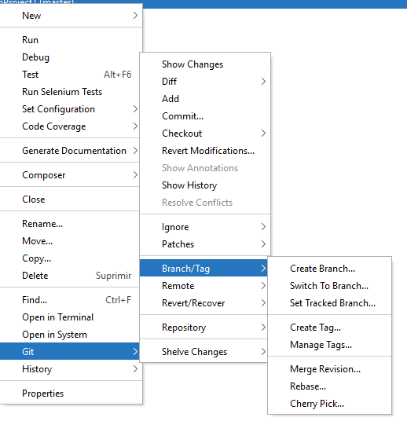|
|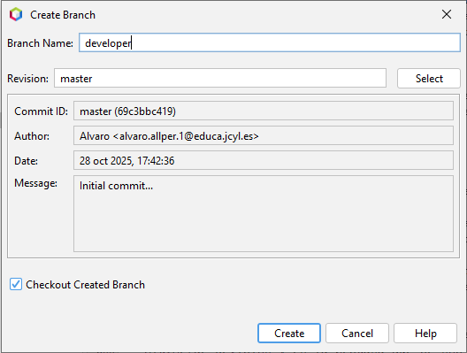|
