[Volver](README.md)

- [1. Entorno de explotación](#1-entorno-de-explotacion)
    - [1.1 Plesk](#11-plesk)
        - [Panel principal](#panel-principal)
        - [Publicación de proyectos](#publicacion-de-proyectos)
    - [1.2 InfinityFree](#12-InfinityFree)
        - [Panel principal](#panel-principal)
        - [Publicación de proyectos](#publicacion-de-proyectos)

## 1. Entorno de explotación
Un entorno de explotación es el espacio donde una aplicación o sistema informático
funciona de manera real y está disponible para los usuarios finales. En este entorno,
el software ya ha sido probado y validado, por lo que se utiliza para ejecutar operaciones
diarias o servicios productivos. Su principal objetivo es garantizar la estabilidad, 
seguridad y rendimiento del sistema en uso. Cualquier cambio o actualización debe 
realizarse con precaución para evitar interrupciones.

### 1.1 Plesk 
En nuestro caso, tenemos como entorno de explotación Plesk, panel de control web que 
permite administar varios servidores y sitios web de forma gráfica.
> **Funcionalidades:** gestión de dominios, correos, bases de datos, seguridad, copias de respaldo y automatización de tareas de hosting.\
> **Versión:** Plesk Obsidian 18.0.72

#### Panel principal
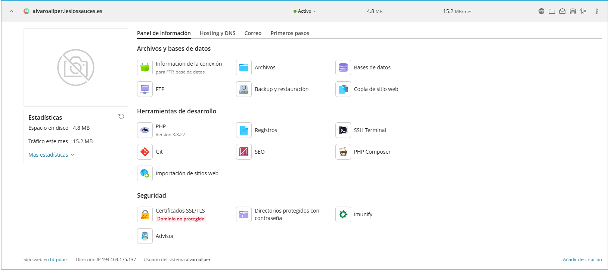\
***Vista del panel de control del servidor web***\
Desde el panel de control se pueden realizar todas les gestionas sobre nuestro servidor 
web y los distintos proyectos activos. En orden descendente y de izquierda a derecha:

**- Información de la conexión**\
Se nos abre una pestaña con toda la información acerca de la conexión SFTP y SSH. 
También tiene un apartado para la conexión con la base de datos.\
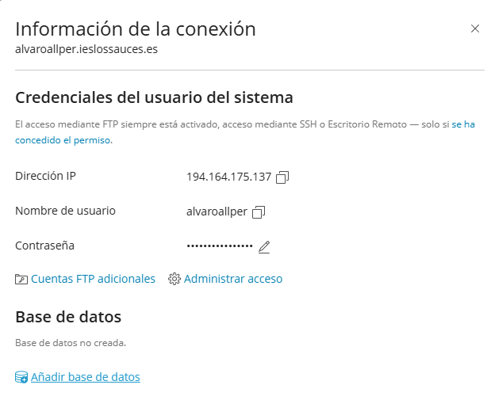

**- Archivos**\
Apartado en el que podremos crear, modificar, eliminar y mover archivos y directorios 
de nuestro servidor web.\
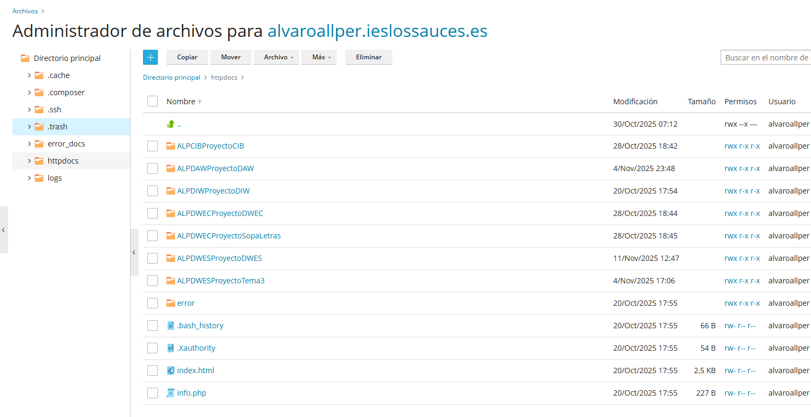

**- Bases de datos**\
Gestor de la base de datos y de usuarios gestores de dichas bases.\
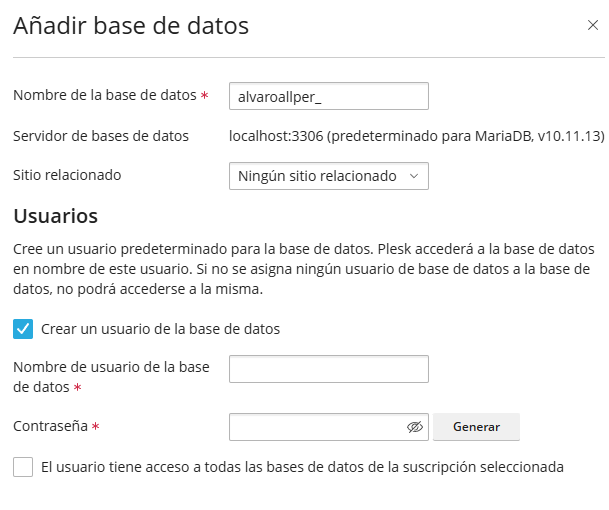

**- FTP**\
En este apartado podremos configurar las credenciales para la conexión SFTP.
**Importante:** se debe solicitar al administrador que habilite esta funcionalidad.\
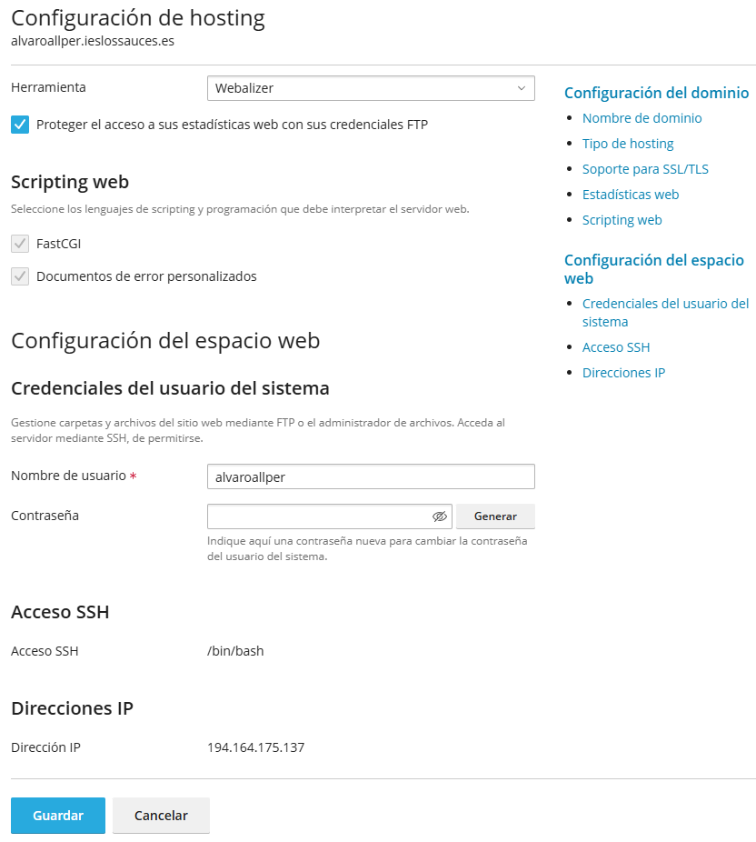

A mayores tenemos un apartado de **herramientas de desarrollo** en el que encontramos todas
las herramientas que nos proporciona Plesk y las versiones compatibles.\
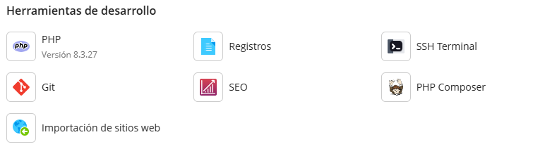

Por último tenemos un apartado de seguridad para poder introducir un certicado SSL/TLS,
proteger los directorios con contraseña y demás funcionalidades de ciberseguridad.\
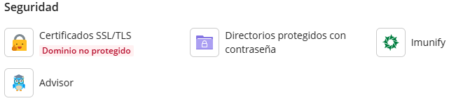

#### Publicación de proyectos
Para publicar nuestros proyectos en el entorno de explotación usaremos el protocolo 
SFTP desde MobaXterm. Para ello deberemos crear una sesión SFTP con las credenciales encontramos
en el apartado información de conexión.\
**Importante:** recordemos que para realizar dicha conexión necesitamos permisos previos 
por parte de nuestro administrador de Plesk.\

Copiamos la dirección IP y el nombre de usuario y realizamos una conexión desde MobaXterm:\
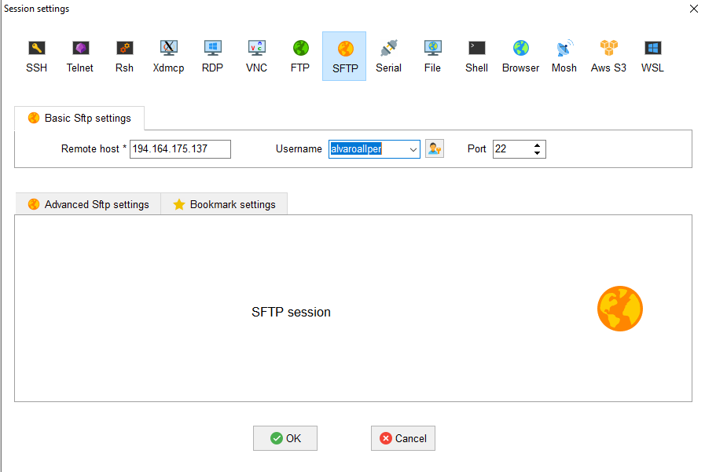

Introducimos la contraseña que, como recomendación, será una fácil de recordar 
(se puede usar la misma que en el entorno de desarrollo).\
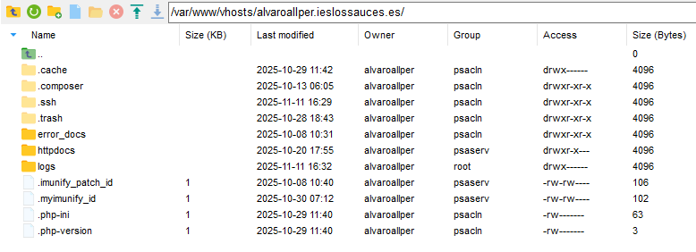

Nuestro directorio de publicación es /httpdocs y en el crearemos todas las carpetas de los proyectos.\
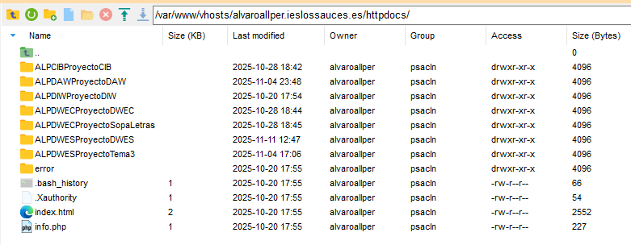

### 1.2 InfinityFree
Entorno de explotación gratuito, sin límite de tiempo, sin anuncios, con soporte para PHP 8.3, 
MariaDB/MySQL, 5GB de espacio disponible y ancho de banda limitado. 

#### Panel principal
El panel de control aun menos vistoso que el de Plesk mantiene el mismo contenido y las mismas opciones.\
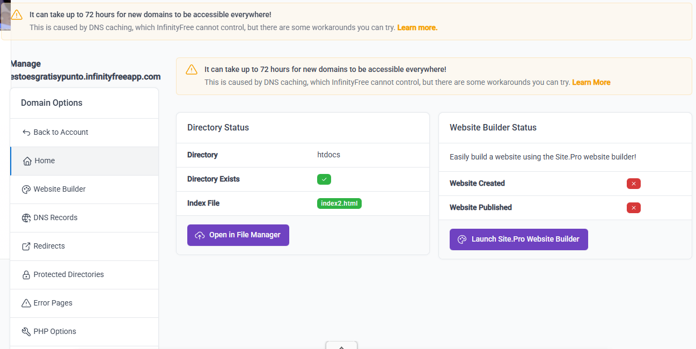

**Aviso importante:** la mayoría de funcionalidades están capadas por ser versión gratuita y 
para ser desbloqueadas se debe pagar una subscripción mensual.
#### Publicación de proyectos
La publicación de los proyectos al entorno de explotación proporcionado por InfinityFree es bastante 
parecida a la de Plesk con la diferencia de que el protocolo es FTP.\
**Importante:** como se puede ver en la captura anterior, el dominio no está disponible en las primeras 72 horas.
Leyendo un poco de información, puede tardar entre 12 y 72 horas.

La conexión sería así:\
En el apartado FTP Details encontramos todos los datos de conexión:\
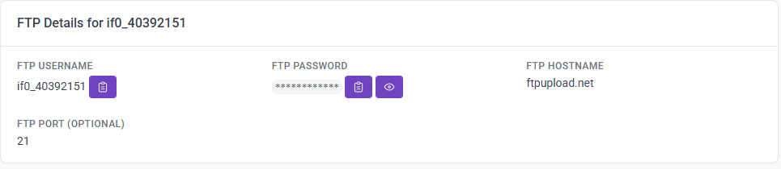

Introducimos los datos en el apartado de sesión FTP:\
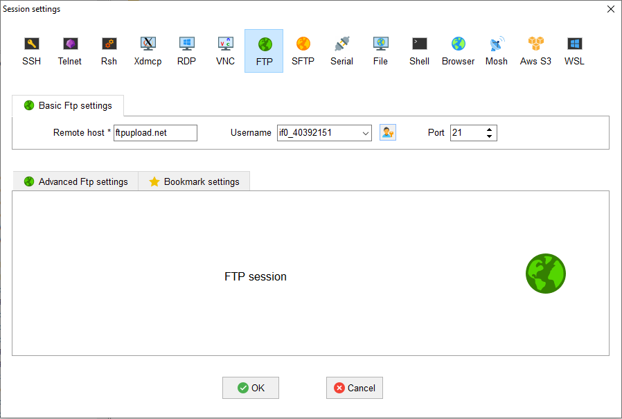

Dejo los proyectos subidos al entorno para probar en cuanto el dominio este operativo:\
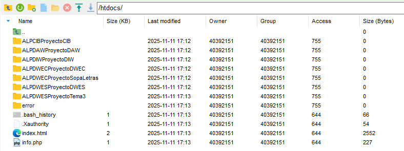
