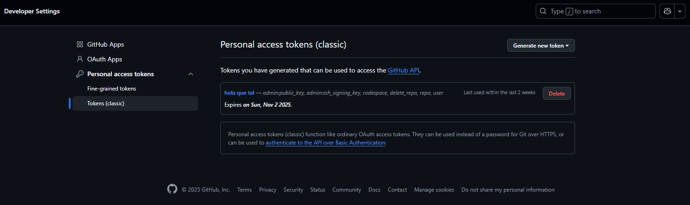
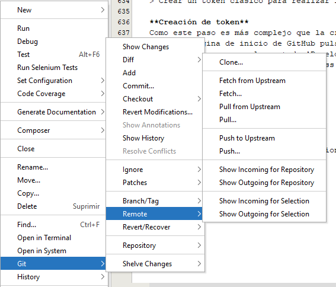
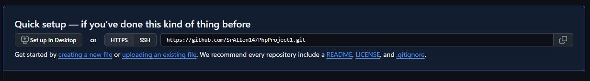
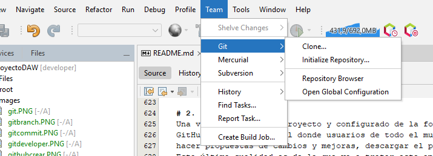
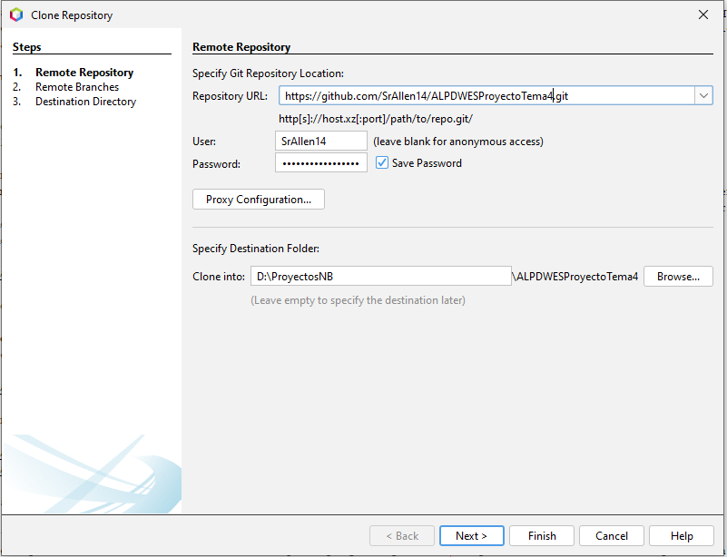
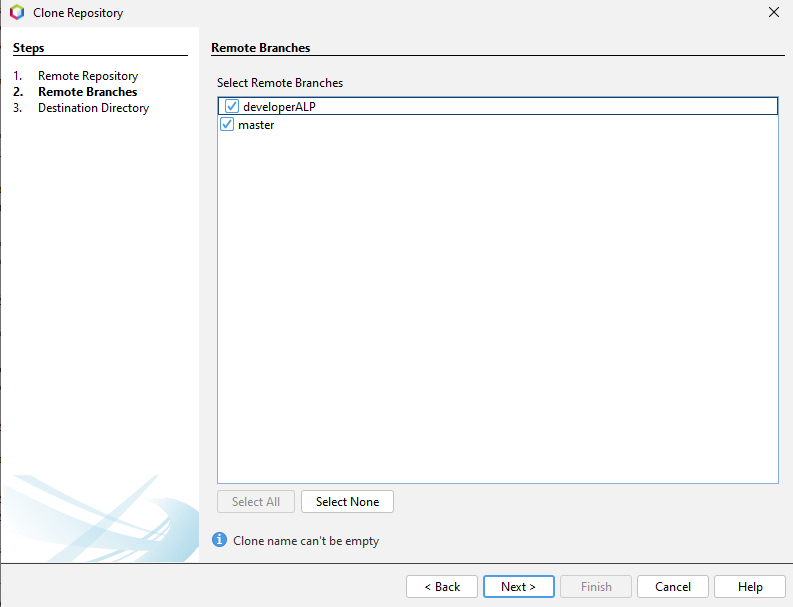
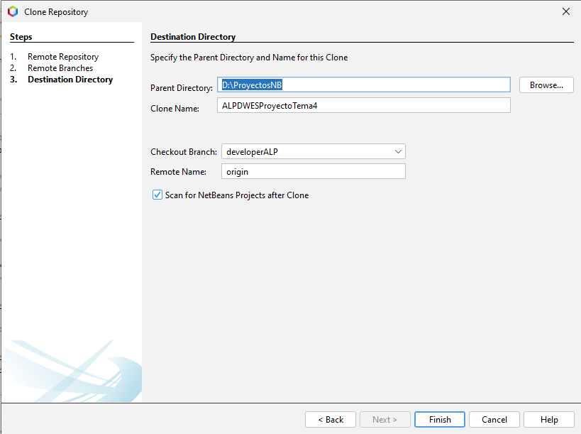

[Volver](README.md)

- [1. GitHub](#1-github)
  - [1.1 Publicación de un repositorio local](#11-publicación-de-un-repositorio-local)
  - [1.2 Clonar un repositorio](#12-clonar-un-repositorio)

## 1. GitHub
Una vez versionado el proyecto y configurado de la forma correcta para su desarrollo, podemos dar un paso más y llevar nuestro repositorio a GitHub.
GitHub es una red social donde usuarios de todo el mundo publican sus proyectos de manera pública o privada. Así cualquier usuario puede ver el código, preguntar
hacer propuestas de cambios y mejoras, descargar el proyecto y probarlo en casa, incluso se puede clonar el repositorio para tenerlo en otro dispositivo. 
Esta última cualidad es de la que va a tratar este apartado.

### 1.1 Publicación de un repositorio local
Para realizar este paso debemos de tener ciertos pasos previos:
> Crear una cuenta de GitHub
> Crear un repositorio (público o privado)
> Crear un token clásico para realizar las subidas y bajadas de contenido a parte de para realizar la clonación.

**Creación de token**
Como este paso es más complejo que la creación de la cuenta de GitHub y el repositorio, vamos a explicarlo detalladamente.
Desde la pagina de inicio de GitHub pulsamos el circulo con nuestra foto de perfil situado en la esquina derecha superior de la pestaña y entramos en 'Settings'
Una vez dentro vamos al apartado 'Developer settings' situado al final de la lista lateral.
Una vez dentro vamos a 'Personal access tokens'>'Tokens (classic)'

||

Es importante guardar el código en un lugar seguro ya que una vez creado no se podrá ver.

**Conexión de un repositorio desde NetBeans**
Haciendo click derecho en el proyecto nos dirigimos a 'Git'>'Remote'>'Push'

||

Dentro de la pestaña indicamos la url del repositorio en GitHub y la contraseña del token

||
||

Indicamos las ramas que queremos publicar y aceptamos.

### 1.2 Clonar un repositorio
No es muy diferente a publicar uno. Estando fuera de cualquier proyecto pulsamos la pestaña team en NetBeans y vamos a 'Team'>'Git'>'Clone'

||

Se nos abrirá la siguiente pestaña en la que escribiremos el enlace del respositorio en GitHub que queremos clonar en local y la contraseña del token.

||

En el siguiente paso deberemos escoger las ramas que queremos clonar del repositorio de GitHub. En este caso, voy a clonar las dos que hay.

||

Por último indicamos donde queremos guardar el proyecto en local que será donde tenemos todos los proyectos del ciclo formativo.

||

Con esto ya podemos empezar a desarrollar en local, publicar los cambios en GitHub y llevarte el trabajo a donde quieras.