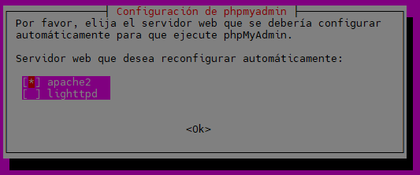
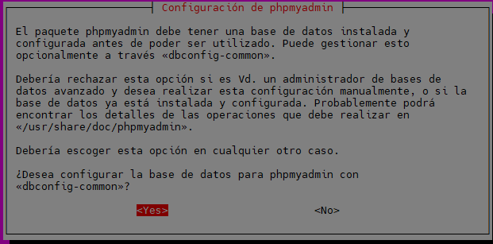
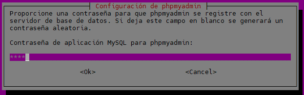
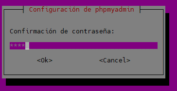
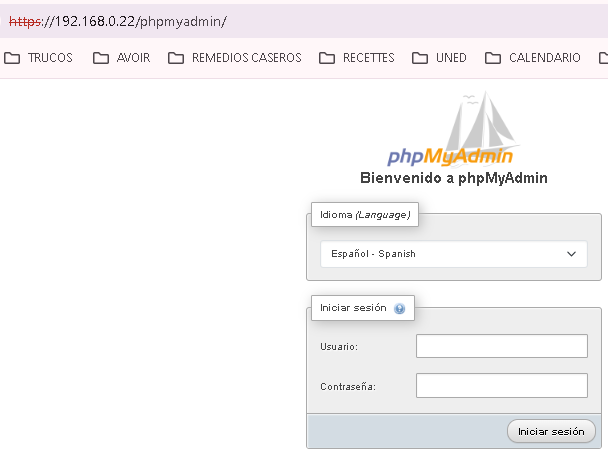

[Volver](README.md)

- [1. Servidor de Desarrollo](#1-servidor-de-desarrollo)
    - [1.1 Ubuntu Server 24.04.3 LTS](#11-ubuntu-server-24043-lts)
        - [Configuración inicial](#configuracion-inicial)
        - [Nombre y configuración de red](#nombre-y-configuracion-de-red)
        - [Actualizar el sistema](#actualizar-el-sistema)
        - [Configuración fecha y hora](#configuracion-fecha-y-hora)
        - [Cuentas administradoras](#cuentas-administradoras)
        - [Habilitar cortafuegos](#habilitar-cortafuegos)
        - [Instalar Antivirus](#instalar-antivirus)
        - [Comprobar conexión](#comprobar-conexion)
    - [1.2 Apache HTTP](#12-Apache-HTTP)
        - [Instalación](#instalación)
        - [Verificación del servicio](#verificacion-del-servicio)
        - [Permisos y usuarios](#permisos-y-usuarios)
        - [Conexión segura (HTTPS)](#protocolo-https)
        - [Redirección a HTTPS](#redireccion-a-https)
        - [Módulos de Apache instalados](#modelos-de-apache-instalados)
    - [1.3 Ejecución PHP con PHP-FPM](#13-ejecucion-php-con-php-fpm)
        - [Instalación](#instalacion)
        - [Configuración de Apache2 con PHP-FPM](#configuracion-de-apache2-con-php-fpm)
        - [Activarlo para todos los virtualhost](#activarlo-para-todos-los-virtualhost)
        - [Configuración del php.ini para un entorno de desarrollo](#configuracion-del-php-ini-para-un-entorno-de-desarrollo)
        - [Comprobación de funcionamiento PHP-FPM](#comprobacion-de-funcionamiento-php-fpm)
    - [1.4 MariaDB](#14-mariadb)
        - [Instalación y configuración de MariaDB](#instalacion-y-configuracion-de-mariadb)
        - [Consola de MariaDB](#consola-de-mariadb)
        - [Creación de un usuario administrador](#creacion-de-un-usuario-administrador)
    - [1.5 PHPMyadmin](#15-phpmyadmin)
        - [Instalacion](#instalacion)
        - [Configuración](#configuracion)
    - [1.6 Módulos PHP](#16-modulos-php)
        - [php8.3-mysql](#php8.3-mysql)
            - [Instalación del módelo y reinicio del servicio PHP-FPM](#instalacion-del-modelo-y-reinicio-del-servicio-php-fpm)
                - [Mostrar qué extensiones están instaladas](#mostrar-que-extensiones-estan-instaladas)
        - [php8.3-intl](#php8.3-intl)
            - [Instalación](#instalacion)
            - [Funciones principales](#funciones-principales)
        - [Módulos y extensiones comunes de PHP](#modulos-y-extensiones-comunes-de-php)
    - [1.7 XDebug](#17-xdebug)
    - [1.8 Redirección por DNS](#18-redireccionamiento-por-dns)
        - [En Plesk](#en-plesk)
        - [En el servidor](#en-el-servidor)
    - [1.9 Redirección DirectoryIndex](#19-redireccion-directoryindex)
    - [1.10 SFTP](#110-sftp)
    - [1.11 LDAP](#111-ldap)
    - [1.12 Herramientas de desarrollo](#112-herramientas-de-desarrollo)
        - [1.2.1 PHPDocumentor](#121-phpdocumentor)
        - [Requisitos mínimos](#requisitos-minimos)
        - [Verificación de requisitos previos](#verificacion-de-requisitos-previos)
        - [Instalación](#instalacion)


## 1. Servidor de Desarrollo

### 1.1 Ubuntu Server 24.04.3 LTS

#### Configuración inicial
**Configuración principal**
> **Nombre de la máquina**: alp-used\
> **Memoria RAM**: 2G\
> **Particiones**: 150G(/) y resto (350GB) (/var)\
> **Configuración de red interface**: xxxx \
> **Dirección IP** :10.199.11.90/22\
> **GW**: 10.199.8.90/22\
> **DNS**: 10.151.123.21 o 10.151.126.21

Para comprobar todos estos valores debemos usar los siguientes comandos:
```bash
hostname
sudo hostnamectl                                # Comprobar el nombre, el sistema operativo, la arquitectura, etc...
sudo hostnamectl set-hostname "nombre"          # Cambiar el nombre de la máquina.
sudo nano /etc/hosts                            # Modificar las siguientes lineas de este archivo.

127.0.0.1 localhost
127.0.1.1 alp_used2                             # En esta línea modificamos el nombre por el nuevo.

free -h                                         # Comprobar la RAM total, en uso y libre. Parámetro -h para que salga  en Gb

lsblk
sudo fdisk -l /dev/sda                          # Comprobar las distintas particiones del disco, su tamaño y su raíz
```
#### Nombre y configuración de red
**Configuración de red**
Antes de realizar cualquier cambio en la configuración mostramos la ip que tenemos y el dns de nuestra red mediante estos comandos.
```bash
ip a
ip r                                            # Comprobar IP y GW como se ve en las capturas de abajo

sudo resolvectl status                          # Comprobar el DNS (educa.jcyl.es)
```
Editar el fichero de configuración del interface de red  **/etc/netplan**.
En este caso los datos introducidos son los mios personales pero cada uno 
puede configurarlo acorde con sus preferencias.

```bash
# This is the network config written by 'subiquity'
network:
  ethernets:
    enp0s3:
      addresses:
       - 10.199.11.90/22
      nameservers:
       - 10.151.123.21
       - 10.151.126.21
       search: [educa.jcyl.es]
      routes:
       - to: default
       via: 10.199.8.1
  version: 2
````

Para terminar, debemos realizar el siguiente comando:
```bash
sudo netplan apply              # Aplicamos la configuración de red guardada en el archivo enp0s3.yaml.
```
#### Actualizar el sistema
Antes de realizar una instalación nueva o directamente, al encender nuestra máquina virtual, debemos actualizar el sistema
y sus aplicaciones.

```bash
sudo apt update                 # Actualiza el sistema y aplicaciones
sudo apt upgrade                # Actualiza los paquetes
```
#### Configuración de fecha y hora
Para comprobar la fecha y la hora, y modificarlas, usaremos los siguientes comandos: 
```bash
date                                                # Comprobar la fecha y hora
# Comprobar la hora y fechar en formato: día YYYY-MM-DD HH:MM:SS 
# También muestra la zona horaría en la que está trabajando el sistema.
timedatectl

# Para modificar la zona horaria debemos usar el siguiente comando:
sudo timedatectl set-timezone Europe/Madrid         # En caso de querer poner la zona horaria de Madrid UTG+1.
```

#### Cuentas administradoras 

**Cuentas administradoras**

> root(inicio)\
> miadmin/paso\
> miadmin2/paso

Apache ya nos crea (durante la instalación principal) una cuenta administradora a la cual podemos introducirle un nombre y una contraseña.

Una vez configurada la red y verificado el servicio, creamos el usuario miadmin2:

```bash
sudo adduser miadmin2                   #Creamos el usuario con contraseña paso e ignoramos el resto de datos que nos piden
```

Una vez creado el usuario tenemos que darle privilegios de sudo, es decir, meterle en el grupo sudoers para que pueda hacer ciertos comandos:

```bash
sudo usermod -aG sudo miadmin2          
# Meter al usuario miadmin2 en el grupo sudo sin quitarle del resto de grupos que pertenece y -G indica los grupos suplementarios a los que quieres añadir el usuario.
# Ahora lo que tenemos que hacer es el meter a miadmin2 en los mismos grupos que miadmin usando este comando y listando
  con cat /etc/group | grep miadmin

**Comandos recomendados**
sudo deluser "nombreusuario"            # Borra el usuario indicado.
su nombreusuario                        # Inicia sesión en el usuario indicado.
exit                                    # Cierra la sesión actual.
```
#### Habilitar cortafuegos
**UFW**\
Para comprobar el estado del cortafuegos y saber si está activado o desactivado, debemos usar el siguiente comando:

```bash
sudo systemctl status ufw                           # Mostrar el status del cortafuegos.
sudo systemctl start|restart ufw                    # Arrancar el cortafuegos.
```

De la misma manera podemos comprobar el SSH:

```bash
sudo systemctl status ssh                           # Mostrar el status del servicio SSH.
sudo systemctl start|restart ssh                    # Arrancar el servicio SSH.

# A mayores tenemos que comprobar el puerto del cortafuegos ufw 22.
sudo ufw status numbered

# Normalmente va a estar activo el puerto 22 y el puerto 22 v6. Éste último hay que borrarlo.
sudo ufw delete "numeropuerto"
```

#### Instalar antivirus
Se actualiza el servidor
```bash
sudo apt update
sudo apt upgrade -y
```

Se intala el antivirus clamav

```bash
sudo apt install clamav clamav-daemon -y
```

Se actualiza la base de datos del virus:
Pimero se detiene el servicio
```bash
sudo systemctl stop clamav-freshclam
```

y se actualiza la base de datos manualmente
```bash
sudo freshclam
```

Se inicia y habilita para el arranque automatico
```bash
sudo systemctl start clamav-freshclam
sudo systemctl enable clamav-freshclam
```

Se verifica el servicio de actualización de definiciones de virus esté activo:
```bash
systemctl status clamav-freshclam
```

Para escanear un archivo o directorio
Escanea un directorio
```bash
sudo clamscan -i /home/
```
Escanea un archivo
```bash
sudo clamscan /home/file.sh
```

Para saber la version del antivirus
```bash
clamscan --version
```

#### Comprobar conexión

**SSH**\
El protocolo de red SSH permite controlar y modificar servidores remotos de manera segura a través de Internet. Utiliza criptografía para
encriptar las conexiones entre dispositivos, garantizando así la seguridad de los datos transmitidos.

En el momento que estamos instalando el sistema operativo Ubuntu Server 24.04.3 LTS el instalador nos pregunta si queremos el servicio SSH.
Por tanto tenemos dos opciones para obtener el servicio SSH en nuestra máquina:

**1ª Opción:** preinstalarlo durante la instalación del sistema operativo.

**2ª Opción:** usar el siguiente comando:
```bash
# Actualizamos el sistema operativo.
sudo apt update

# Instalamos el servicio SSH.
sudo apt install openssh-server -y
```

En cualquiera de los dos casos debemos de comprobar que se ha instalado el servicio correctamente:
```bash
sudo systemctl status ssh

# En caso de necesitar iniciarlo o reiniciarlo tenemos este comando
sudo systemctl [start|restart] ssh

# Para que el servicio se inicie cada vez que se encienda la máquina tenemos este comando
sudo systemctl enable ssh
```

Conexión SSH
Para conectarnos con la máquina con SSH deberemos abrir la consola de comandos en un dispositivo de la misma red
y escribir el siguiente comando:
```bash
ssh 'usuario'@'ip'
```

Nos pedirá la contraseña del usuario y nos iniciará sesión. En ese momento podremos gestionar en remoto desde esa consola.
Hay que tener en cuenta que los límites de que se puede hacer los marcan los privilegios que tenga el usuario conectado.

### 1.2 Apache HTTP

#### Instalación
Para instalar un servidor web vamos a descargar y configurar Apache. El primer paso es actualizar el SO y 
también los paquetes instalados. A continuación instalamos Apache2 y abrimos el puerto 80 que es el utilizados 
por Apache. Al abrir el puerto se abrirá tanto el normal como el (v6) y, por recomendación de seguridad, lo borraremos.

```bash

sudo apt update                         #Actualizamos OS
sudo apt upgrade                        #Actualizamos paquetes instalados

sudo apt install apache2                #Instalamos Apache2 en la máquina
  
sudo ufw allow 80                       #Habilitamos el puerto 80 desde el cortafuegos.

sudo ufw status numbered                
sudo ufw delete 'numeropuerto'          #Borramos el puerto 80 (v6) usando su número de indetificación

```
#### Verficación del servicio

Para verificar que Apache se ha instalado y está funcionando correctamente tenemos dos formas: entrando a un 
navegador desde el ordenador anfitrión y buscando la página con al dirección IP de la máquina. Si aparece una 
página como la de abajo es que Apache esta funcionando correctamente y que ambas máquinas están en la misma red. 
La otra forma es mediante los siguientes comandos:

```bash

sudo service apache2 {opcion}
sudo systemctl {opcion} apache2

```

#### Permisos y usuarios
Ahora vamos a crear el usuario "operadoweb" que será el encargado de subir archivos al servidor. Solo podrá tener acceso a su carpeta ráiz
que es /var/www/html y pertenecerá al grupo www-data

```bash
sudo adduser --home /var/www/html --ingroup www-data --shell /bin/bash operadorweb

# Ahora debemos cambiar el dueño de la carpeta /var/www/html para que pertenezca a operadorweb
sudo chown -R operadorweb:www-data /var/www/html            # Cambia el propietario y el grupo del directorio indicado.
sudo chmod -R 775 /var/www/html                             # Cambia los permisos del usuario propietario, del grupo y del resto de propieatarios.

# Para comprobar que los cambios han surgido efecto debemos hacer lo siguiente:
ls -al /var/www/html

drwxrwxr-x 2 operadorweb www-data  4096 oct  9 10:30 .
drwxr-xr-x 3 root        root      4096 oct  9 10:30 ..
-rwxrwxr-x 1 operadorweb www-data 10671 oct  9 10:30 index.html

```
#### Protocolo HTTPS
Es la versión segura del protocolo HTTP, el cual cifra la comunicación entre el navegador y el servidor, 
garantizando confidencialidad, integridad y autenticación de los datos.

**Instalación**
Generar clave privada SSL
```bash
# Generamos la solicitud de certificado.
sudo openssl req -x509 -nodes -days 365 -newkey rsa:2048 -keyout /etc/ssl/private/alp-used.key -out /etc/ssl/certs/alp-used.crt

# A continuación vamos a introducir los datos del certificado:
Country Name: ES
State or Province Name: Zamora
Locality Name: Benavente
Organization Name: Instituto
Organizational Unit Name: Informatica
Common Name: alp-used
Email Address: alvaro.allper.1@educa.jcyl.es

# Para comprobar que se ha creado correctamente.
sudo ls /etc/ssl/certs | grep alp-used
sudo ls /etc/ssl/private | grep alp-used

# Reiniciamos el servicio apache
sudo systemctl restart apache2

# Nos situamos en el directorio /etc/apache2/sites-available y hacemos una copia del archivo default-ssl.conf
cd /etc/apache2/sites-available
sudo cp default-ssl.conf alp-used.conf

# Modificamos el archivo copiado alp-used.conf con las siguientes líneas:

SSLCertificateFile      /etc/ssl/certs/alp-used.crt
SSLCertificateKeyFile   /etc/ssl/private/alp-used.key

# Activamos el archivo de configuración modificado y reinicamos el servicio apache.
sudo a2ensite alp-used.conf
sudo systemctl restart apache2

# También debemos activar el puerto 443 en el firewall y borrar el v6.
sudo ufw allow 443
sudo ufw status numbered # Comprobar el número del puerto 443(v6)
sudo ufw delete (nº)
```

**Consejo**
Al entrar con un navegador al servidor, nos indica que no es seguro debido a que la autoridad certificadora no es segura.
El certificado es autofirmado por el usuario, en este caso yo, y no es de confianza para el navegador. Esto se puede se puede resolver
de dos formas.
> 1. Pedir a una autoridad certificadora que firme el certificado para que así sea reconocido por el navegador y sea seguro.\
> 2. Introducir como autoridad certificadora a tu propio usuario en tu dispositivo. No supone un riesgo ya que te estás dando confianza
> a ti mismo.


#### Redirección a HTTPS
Para realizar el redireccionamiento de HTTP a HTTPS necesitamos activar el módulo alias:
```bash
# Seguramente este activado.
sudo a2enmod alias

# Recargamos el servicio apache2.
sudo systemctl reload apache2
```

Editamos el fichero /etc/apache2/sites-available/000-default.conf de la siguiente forma:\
> Redirect / https://ipservidor

También se puede hacer de esta forma.
activando el modulo rewrite
```bash
sudo a2enmod rewrite
```
y escribiendo esto en el .haccess
```bash
RewriteEngine On
RewriteCond %{SERVER_PORT} 80
RewriteRule ^(.*)$ https://10.199.10.49/$1 [R,L]
```

Recargamos el servicio y comprobamos que, al entrar en el servidor web, se nos redirige a https://....

#### Módulos de Apache instalados
| Módulo | Tipo | Descripción | Uso Principal |
| :--- | :--- | :--- | :--- |
| **core\_module** | Static | Funcionalidad **fundamental** del servidor. | No puede ser desactivado, maneja las directivas básicas como `AllowOverride`. |
| **so\_module** | Static | Habilita la carga de otros módulos **compartidos** (*Shared Objects*). | Permite usar la directiva `LoadModule`. Es vital para el funcionamiento modular. |
| **watchdog\_module** | Static | Herramienta interna para monitorear y gestionar procesos. | Mantenimiento de la estabilidad y procesos internos. |
| **http\_module** | Static | Implementa el protocolo HTTP. | Maneja la comunicación y las peticiones web. |
| **log\_config\_module** | Static | Configuración de los archivos de registro (logs). | Define los formatos de los logs (`CustomLog`, `ErrorLog`). |
| **logio\_module** | Static | Registro de la entrada/salida de la red (bytes transferidos). | Añade información de I/O a los logs. |
| **version\_module** | Static | Permite definir configuraciones basadas en la versión de Apache. | Útil para compatibilidad en entornos heterogéneos. |
| **unixd\_module** | Static | Funcionalidad específica para sistemas Unix (gestión de ID de usuario y grupo). | Define el usuario y grupo bajo el que se ejecuta Apache (`User`, `Group`). |
| **access\_compat\_module** | Shared | Proporciona compatibilidad con directivas de control de acceso antiguas. | Permite usar directivas obsoletas como `Order`, `Deny`, `Allow`. |
| **alias\_module** | Shared | Mapea URLs a directorios fuera de la raíz del documento. | Define rutas virtuales (`Alias`, `ScriptAlias`). |
| **auth\_basic\_module** | Shared | Implementa la **autenticación básica** HTTP simple. | Pide nombre de usuario y contraseña para acceder a recursos. |
| **authn\_core\_module** | Shared | Base para todos los módulos de autenticación (el motor central). | Requerido por cualquier módulo que maneje credenciales. |
| **authn\_file\_module** | Shared | Autenticación basada en archivos de texto (`.htpasswd`). | Verifica credenciales contra un archivo local. |
| **authz\_core\_module** | Shared | Base para todos los módulos de autorización (el motor central). | Define quién tiene permitido acceder a los recursos (`Require`). |
| **authz\_host\_module** | Shared | Autorización basada en el **nombre de host o dirección IP** del cliente. | Restringe el acceso por IP o dominio. |
| **authz\_user\_module** | Shared | Autorización basada en el **usuario autenticado**. | Restringe el acceso a usuarios específicos. |
| **autoindex\_module** | Shared | Genera automáticamente un **listado de archivos** si no hay `DirectoryIndex`. | Muestra el contenido de un directorio si no hay `index.html`. |
| **deflate\_module** | Shared | **Compresión de contenido** antes de enviarlo al cliente. | Reduce el tamaño de los datos (HTML, CSS, JS) para una carga más rápida. |
| **dir\_module** | Shared | Maneja la configuración de **`DirectoryIndex`**. | Define el archivo predeterminado a cargar (como `index.php`). |
| **env\_module** | Shared | Manipulación de **variables de entorno**. | Permite pasar variables de entorno a los scripts (ej: a PHP). |
| **filter\_module** | Shared | Permite el procesamiento de contenido a través de filtros. | Es la base para aplicar otros módulos (como `deflate`) al contenido. |
| **mime\_module** | Shared | Determina el **tipo MIME** (contenido) de los archivos. | Envía la cabecera `Content-Type` correcta (ej: `text/html`, `image/jpeg`). |
| **mpm\_event\_module** | Shared | **Módulo Multipróceso (MPM)**. Maneja el modelo de concurrencia y procesos. | Modelo eficiente para manejar muchas peticiones simultáneas, común en sistemas modernos. |
| **negotiation\_module** | Shared | Negociación de contenido (elegir el mejor idioma, codificación, etc.). | Sirve el archivo `.en.html` si el navegador pide inglés. |
| **proxy\_module** | Shared | Permite que Apache actúe como un servidor **proxy**. | Reenvía peticiones a otros servidores o aplicaciones. |
| **proxy\_fcgi\_module** | Shared | Conector de proxy para **FastCGI**. | **Crucial para PHP**: Permite que Apache pase peticiones a un proceso PHP-FPM dedicado. |
| **reqtimeout\_module** | Shared | Establece límites de tiempo para recibir el encabezado y el cuerpo de una solicitud. | Protege contra ataques lentos (Slowloris). |
| **setenvif\_module** | Shared | Establece variables de entorno basándose en encabezados HTTP. | Útil para personalizar el comportamiento del servidor según el cliente. |
| **socache\_shmcb\_module** | Shared | Soporte para caché de objetos en memoria compartida. | Usado a menudo por el módulo `ssl_module` para almacenamiento en caché de sesiones TLS. |
| **ssl\_module** | Shared | Implementa el cifrado **SSL/TLS (HTTPS)**. | Permite manejar certificados y comunicación segura. |
| **status\_module** | Shared | Proporciona una página con el **estado y rendimiento** del servidor. | Permite monitorear el uso de procesos y la carga de Apache. |

---

### 1.3 Ejecución PHP con PHP-FPM
FPM (FastCGI Process Manager) es un servidor de aplicaciones PHP que se encarga de interpretar código PHP.

#### Instalación
Una vez actualizado el sistema y mejorado los paquetes (update y upgrade) debemos de realizar los siguientes pasos:
```bash
# Comprobamos que apache está instalado y activo.
sudo systectl status apache2

# A continuación instalamos PHP y PHP8.3-FPM con la versión 8.3
sudo apt install php8.3-fpm php8.3
```

En caso de no haber salido error al reiniciar, creamos en nuestro directorio ráiz del servidor un info.php y le introducimos lo siguiente:
```bash
<?php
phpinfo();
?>
```
Entramos en nuestra página principal y escribimos en la barra de busqueda:
http://direccionip/info.php. Nos debería de salir una página como esta.

#### Configuración de Apache2 con PHP-FPM
Para habilitar los modulos Proxy-FCGI y SetEnvif

```bash
sudo a2enmod proxy-fcgi setenvif
```

#### Activarlo para todos los virtualhost
El fichero de configuración php8.3-fpm en el directorio /etc/apache2/conf-available, por defecto funciona cuando php-fpm está escuchando en un socket UNIX Se configura de la siguiente forma:

Se abre el fichero /etc/apache2/conf-available/php8.3-fpm.conf
```bash
sudo nano /etc/apache2/conf-available/php8.3-fpm.conf
```

Y se copia esto o se comprueba si ya está:
```bash
 <FilesMatch ".+\.ph(?:ar|p|tml)$">
    SetHandler "proxy:unix:/run/php/php8.3-fpm.sock|fcgi://localhost"
</FilesMatch>
```

Por último activamos (o comprobamos que esta activado) y se recarga apache2:
```bash
sudo a2enconf php8.3-fpm
sudo systemctl restart apache2

# Si se quisiera desactivar el fichero de configuración
sudo a2disconf php8.3-fpm
```

#### Configuración del php.ini para un entorno de desarrollo.
Primero se hace una copia del archivo.  
```bash
cd /etc/php/8.3/fpm/
sudo cp php.ini php.ini.bk2025
sudo nano php.ini
```

* Configuración PHP por Entorno

Esta tabla compara las configuraciones de PHP para los entornos de **Desarrollo** y **Producción** en las secciones **General** y **Errores**.

| Directiva | DESARROLLO | PRODUCCIÓN |
| :--- | :--- | :--- |
| **GENERAL** | | |
| `file-uploads` | `On` | `On` |
| `allow-url_fopen` | `On` | `Off` |
| `memory_limit` | `256M` | `256M` |
| `upload_max_filesize` | `100M` | `100M` |
| `max_execution_time` | `360` | `360` |
| `date.timezone` | `Europe/Madrid` | `Europe/Madrid` |
| **ERRORES** | | |
| `display_errors` | `On` | `Off` |
| `error_reporting` | `E_ALL` | `E_ALL & ~E_NOTICE` |
| `display_startup_errors` | `On` | `Off` |
| `log_errors` | `On` | `On` |
| `error_log` | `/var/log/php_errors.log` | - |

---

La configuración que vamos a aplicar en nuestro servicio de PHP es el siguiente:
> display_errors: On
> display_startup: On
> memory_limit: 256M

El display_errors sirve para mostrar los errores de ejecución en la salida (navegador
o consola) y el display_startup_errors para controlar los errores que surgen durante la
ejecución PHP.

El límite de memoria o memory_limit en el archivo de configuración sirve para establecer
un límite máximo de memoria que puede usar un archivo PHP.

Una vez explicado vamos a ir paso por paso detallando como aplicar esta configuración:

Una vez instalado PHP y comprobado que nos funciona el info.php entramos en el directorio
/etc/php/8.3/fpm donde encontraremos el archivo de configuración php.ini.
```bash
cd /etc/php/8.3/fpm

# Listamos el contenido y encontramos el archivo de configuración php.ini. Lo copiamos.
sudo cp php.ini php.ini.backup

#Modificamos el archivo php.ini cambiando los valores de display_errors, display_startup_errors
y memory_limit con los valores de On, On y 256M. Puedes user ctrl+w para buscar palabras en 
el editor.
sudo nano php.ini

#Una vez modificado y guardado, reiniciamos el servicio PHP.
sudo systemctl restart php8.3-fpm
```

Para comprobar que dicha configuración se ha aplicado vamos a la página info.php y comprobamos
que dichos valores han cambiado y son los introducidos en el archivo de configuración.

> **Consejo:**\
> En el info.php hay un apartado llamado "Loaded configuration File" que indica la ruta donde se encuentra el archivo que acabamos de modificar.

* Se reinicia el servicio php y se comprueba que está corriendo.

```bash
sudo systemctl restart php8.3-fpm.service
sudo systemctl status php8.3-fpm.service
```
Se puede comprobar que los datos se han cambiado en el php.info().

* Para ver los módulos activos de php:
```bash
apache2ctl -M
```

#### Comprobación de funcionamiento PHP-FPM
PHP-FPM puede escuchar por socket UNIX o TCP/IP (host:puerto). Revisar cada "pool" en Ubuntu en `/etc/php/8.3/fpm/pool.d/www.conf`

```bash
grep '^listen' /etc/php/8.3/fpm/pool.d/*.conf
```

Dos posibles resultados:

```bash
listen = /run/php/php8.3-fpm.sock

```

Esta escuchando en socket UNIX

```bash
listen = 127.0.0.1:9000
```

Está escuchando por TCP/IP en la dirección local

### 1.4 MariaDB
El gestor de base de datos que hemos escogido, compatible con PHP, es MariaDB.
MariaDB es un sistema de gestión de bases de datos relacional, muy similar a MySQL, permitiendo almacenar, organizar y acceder a información mediante el lenguaje SQL.
A continuación detallaremos el proceso de instalación y puesta en marcha de este servicio.

##### Instalación y configuración de MariaDB

```bash
# Actualizamos el OS
sudo apt update

# Instalamos MariaDB
sudo apt install mariadb-server -y

# Una vez instalado comprobamos la version de MariaDB instalada.
mariadb --version

mariadb Ver 15.1 Distrib 10.11.13
```

**Configuración**\
Una vez instalado el servicio de MariaDB nos vamos a la configuración de esta misma.

```bash
# Nos dirigimos a este archivo y lo modificamos /etc/mysql/mariadb.conf.d/50-server.cnf
sudo nano /etc/mysql/mariadb.conf.d/50-server.cnf

# Modificamos bind-address = 127.0.0.1 por: 0.0.0.0 y guardamos
# Reiniciamos el servicio
sudo systemctl restart mariadb

# Aunque no nos de error al reiniciar debemos hacer una comprobación para estar seguros de que el proceso está en ejecución.
sudo ss -punta | grep mariadb

# Nos debe salir una linea así: tcp LISTEN 0 80 0.0.0.0:3306 0.0.0.0:* users:(("mariadb",pid=7865,fd=22))
```

Con esto ya tenemos un servidor sql trabajando correctamente en nuestra máquina ubuntu server.
Para iniciar el servicio en modo comando, nos iniciará sin autenticar ningún usuario. 

* Comandos útiles del servicio

| Acción                         | Comando                          | Descripción                                                  |
| ------------------------------ | -------------------------------- | ------------------------------------------------------------ |
| Iniciar el servicio            | `sudo systemctl start mariadb`   | Inicia el servidor MariaDB.                                  |
| Detener el servicio            | `sudo systemctl stop mariadb`    | Detiene el servidor MariaDB.                                 |
| Reiniciar el servicio          | `sudo systemctl restart mariadb` | Reinicia el servidor.                                        |
| Ver estado del servicio        | `sudo systemctl status mariadb`  | Muestra si el servidor está activo o inactivo.               |
| Habilitar inicio automático    | `sudo systemctl enable mariadb`  | Configura el servicio para iniciarse al arrancar el sistema. |
| Deshabilitar inicio automático | `sudo systemctl disable mariadb` | Evita que el servicio se inicie automáticamente.             |
| Ver versión instalada          | `mariadb --version`              | Muestra la versión actual de MariaDB instalada.              |

**Instalación de módulos**\
Todo esto se puede realizar previo a instalar el mysql ya que esto es una configuración de PHP.
Modelo php8.3-mysql es la extensión que permite a PHP conectarse con el servidor de bases de datos.
```bash
sudo apt install php8.3-mysql
sudo apt install php8.3-intl           # Extensión de internalización básica para SQL.
```
Ahora se listan los módulos mediante el siguiente comando (este paso se debe realizar previo a la instalación y después):
```bash
sudo php -m | grep mysql
# Si se realiza antes de instalar los módulos debería de aparecer vacio.
# En caso de hacerlo después apareceran varios módulos: mysqli, mysqlnd, pdo_mysql.
``` 
**----------------------**

**Conexión con NetBeans**\
Para conectar el NetBeans a la base de datos debemos de descargar el driver necesario:
mariadb-java-cliente-3.5.6.

Una vez descargado y guardado en una carpeta llamada lib entraremos en NetBeans e iremos al apartado 'Services'>'Databases'
Haremos click derecho donde pone 'MariaDB(MySQL-compatible)' y se nos abrirá una pestaña de conexión.
En esta pestaña añadiremos el driver descargado y continuaremos a efectuar la conexión.
En cada apartado pondremos lo siguiente:
**Host:** 10.199.11.90 (ip de la máquina)
**Port:** 3306
**Database:** se puede dejar vacio o introducir uno cual sea.
**User Name:** adminsql
**Password:** paso

Antes de continuar con la conexión podemos testearla para confirmar que funciona.
Por último decidimos el nombre de la conexión para facilitarnos su uso y aceptamos.
Ya podemos realizar todas las operaciones que el usuario introducido puede hacer con los permisos que tenga.
#### Consola de MariaDB
Se entra al cliente:

```bash
sudo mariadb
```

Luego se ejecuta:

```sql
SHOW VARIABLES LIKE 'port';
```

Resultado esperado:

| Variable_name | Value |
| ------------- | ----- |
| port          | 3306  |

#### Creación de un usuario administrador
En sistemas Ubuntu con MariaDB 10.3, el usuario **root** se autentica mediante el complemento **unix_socket** por defecto, en lugar de una contraseña.
Esto ofrece mayor seguridad, pero puede complicar el acceso desde programas externos (p. ej., phpMyAdmin).

> **No se recomienda modificar la cuenta root.**
> En su lugar, crea una cuenta administrativa independiente para autenticación con contraseña.

Se abre el cliente de MariaDB:

```bash
sudo mariadb
```

Luego se crea un nuevo usuario con privilegios de root:

```sql
CREATE USER 'adminsql'@'%' IDENTIFIED BY 'paso';
GRANT ALL PRIVILEGES ON *.* TO 'adminsql'@'%' WITH GRANT OPTION;
```

O también se puede usar:

```sql
GRANT ALL ON *.* TO 'adminsql'@'%' IDENTIFIED BY 'paso' WITH GRANT OPTION;
```

 Se puede listar todos los usuarios y sus hosts:

```sql
SELECT User, Host FROM mysql.user;
```

Conectarse de forma remota con el nuevo usuario: (fuera del cliente MariaDB)

```bash
mariadb -u adminsql -p -h your_server_ip
```

---

* Asegurar el servidor MariaDB

Se ejecuta el script de seguridad:

```bash
sudo mysql_secure_installation
```

Este asistente te permitirá:

* Configurar una contraseña fuerte para root.
* Eliminar usuarios anónimos.
* Deshabilitar el inicio de sesión remoto del root.
* Eliminar bases de datos de prueba.
* Recargar las tablas de privilegios.

* Pasos del asistente

1. Pulsa **Enter** si no hay contraseña de root definida.
2. Define una **contraseña segura** para el usuario root.
3. Elimina el usuario anónimo (**Sí**).
4. Desactiva el acceso remoto del usuario root (**Sí**).
5. Elimina la base de datos de prueba (**Sí**).
6. Recarga los privilegios (**Sí**).

### 1.5 PHPMyadmin

#### Instalación
* Enlace tutorial :https://www.devtutorial.io/how-to-install-phpmyadmin-with-apache-on-ubuntu-24-04-p3467.html

Antes de instalar se miran los modulos instalados.
```bash
php -m > /home/miadmin/listadomodulos.txt
```
Despues de instalar:
```bash
php -m > /home/miadmin/listadomodulos2.txt
```
Y comparamos los dos ficheros. En /home/miadmin, se buscan las diferencias entre los archivos.
```bash
diff listadomodulos.txt listadomodulos2.txt
```

* Se actualiza el servidor
```bash
sudo apt update
sudo apt upgrade
```
* Se instala phpMyadmin
```bash
sudo apt install phpmyadmin
```
* Se abre la consola de instalación
Se selcciona apache como servidor web, con la barra espaciadora y se mueve el cursor con las flechas y con tab hacia el Ok.\


Se confirma la base de datos selecionando YES\


Se indica la contraseña\


Se confirma la contraseña\


#### Configuración
* Se crea un enlace simbolico de phpMyadmin a Apache
```bash
sudo ln -sf /etc/phpmyadmin/apache.conf /etc/apache2/conf-available/phpmyadmin.conf
```
* Se habilita la configuración de phpmyadmin
```bash
sudo a2enconf phpmyadmin
```
* Se hace el restar a Apache
```bash
sudo systemctl restart apache2
```
* Se prueba en el navegador si funciona.  
  

* Se ponen las credenciales del usuario de la base de datos. En este caso adminsql, y se accede a la base de datos.  
  
Se puede ver el la parte izquierda las bases de datos creadas.

### 1.6 Módulos PHP

#### a) `php8.3-mysql`

El módulo **php8.3-mysql** es la extensión que permite a PHP conectarse y comunicarse con servidores de bases de datos **MySQL** o **MariaDB**.  
Sin este módulo, PHP no puede ejecutar consultas SQL, ni leer ni escribir datos en su base de datos.

##### Instalación del módulo y reinicio del servicio PHP-FPM

```bash
sudo apt install php8.3-mysql
sudo systemctl restart php8.3-fpm
```

####### Mostrar qué extensiones están instaladas

```bash
sudo php -m | grep mysql
```

#### b) `php8.3-intl`

La extensión **php8.3-intl** (Internationalization) está basada en la biblioteca **ICU (International Components for Unicode)**.
Permite que PHP muestre información adaptada a la región e idioma sin configuraciones manuales.

##### Instalación

```bash
sudo apt install php8.3-intl
```

##### Funciones principales

| Funcionalidad                           | Descripción                                                              | Ejemplo                                                |
| --------------------------------------- | ------------------------------------------------------------------------ | ------------------------------------------------------ |
| **Formateo de fechas y horas**          | Muestra las fechas según idioma o país                                   | `27 de octubre de 2025 (es)` / `October 27, 2025 (en)` |
| **Formateo de números**                 | Usa separadores decimales y de miles según la región                     | `1.220,66 (es_ES)` / `1,220.66 (en_US)`                |
| **Monedas**                             | Formatea precios automáticamente según el país                           | `€ 1.200,50` / `$ 1,200.50`                            |
| **Traducción y comparación de cadenas** | Ordena y compara texto con reglas locales                                | Útil para ordenar palabras con acentos                 |
| **Normalización Unicode**               | Asegura que caracteres acentuados o especiales se comparen correctamente | Útil para búsquedas y validaciones                     |


###@ Módulos y Extensiones Comunes de PHP

| Módulo | Descripción | Uso Principal |
| :--- | :--- | :--- |
| **bz2** | Soporte para el algoritmo de compresión **Bzip2**. | Leer y escribir archivos comprimidos `.bz2`. |
| **calendar** | Funciones para convertir entre diferentes sistemas de calendario. | Conversión entre calendarios (Juliano, Gregoriano, Hebreo, etc.). |
| **Core** | El corazón de PHP. Contiene todas las funcionalidades básicas del lenguaje. | Funciones y constantes fundamentales (siempre habilitado). |
| **ctype** | Funciones para verificar el tipo de caracteres. | Comprobación de si un carácter es alfanumérico, dígito, etc. |
| **curl** | Soporte para la librería **cURL**. | Realizar peticiones HTTP, FTP y otras transferencias de red. |
| **date** | Manejo de fechas y horas, incluyendo la clase `DateTime`. | Formateo, manipulación y cálculo de fechas y zonas horarias. |
| **dom** | Manipulación del **DOM (Document Object Model)**. | Analizar y manipular documentos HTML y XML como objetos. |
| **exif** | Extracción de información de metadatos (EXIF) de archivos de imágenes. | Leer la información de la cámara (fecha, modelo, exposición) de fotos. |
| **FFI** | **Foreign Function Interface**. Permite llamar a funciones de bibliotecas compartidas de C nativas. | Interoperabilidad con código C sin necesidad de extensiones. |
| **fileinfo** | Detección del **tipo de contenido** (MIME) de un archivo. | Determinar de forma segura si un archivo es una imagen, PDF, etc. |
| **filter** | Herramientas para **validar y sanear** entradas de datos. | Limpiar entradas de usuario (formularios, URLs) para evitar inyecciones. |
| **ftp** | Funciones del **Protocolo de Transferencia de Archivos (FTP)**. | Conexión, subida y descarga de archivos a través de FTP. |
| **gd** | Soporte para la librería **GD Graphics Library**. | Creación, manipulación y generación de imágenes (miniaturas, CAPTCHAs). |
| **gettext** | Soporte para internacionalización (i18n) usando la librería GNU **gettext**. | Localización de cadenas de texto de la aplicación. |
| **hash** | Funciones de *hashing* criptográfico. | Generación de *hashes* seguros (SHA-256, MD5, etc.). |
| **iconv** | Conversión de codificación de caracteres. | Convertir cadenas entre diferentes codificaciones (ej: UTF-8 a ISO-8859-1). |
| **intl** | Extensión de **Internacionalización** basada en la librería ICU. | Soporte avanzado para formatos de moneda, fechas, ordenación de texto (collator). |
| **json** | Codificación y decodificación de datos en formato **JSON**. | Intercambio de datos con APIs web (REST, etc.). |
| **libxml** | Soporte para la librería **libxml**. Requerido por otras extensiones XML y DOM. | Funciones básicas para trabajar con XML. |
| **mbstring** | **Multibyte String**. Funciones para manipular cadenas de caracteres multibyte. | Trabajar correctamente con codificaciones como UTF-8 (necesario para la mayoría de los idiomas). |
| **mcrypt** | (Obsoleto en PHP 7.2+) Interfaz para la librería de **cifrado Mcrypt**. | Tareas de cifrado y descifrado. |
| **mysqli** | Interfaz mejorada para la base de datos **MySQL**. | Conexión y manipulación de bases de datos MySQL. |
| **mysqlnd** | **MySQL Native Driver**. Sustituto de bajo nivel para `libmysql`. | Proporciona un controlador más rápido para las extensiones `mysqli` y `PDO_MySQL`. |
| **openssl** | Funciones de criptografía basadas en la librería **OpenSSL**. | Implementación de SSL/TLS, *hashing*, certificados y cifrado seguro. |
| **pcntl** | **Process Control**. Funciones para la gestión de procesos en sistemas POSIX. | Crear *forks* y gestionar procesos hijo (común en scripts de *daemon*). |
| **pcre** | **Perl Compatible Regular Expressions**. | Motor de expresiones regulares (como `preg_match`). |
| **PDO** | **PHP Data Objects**. Interfaz de abstracción de bases de datos. | Proporciona una interfaz común para interactuar con diferentes bases de datos (MySQL, PostgreSQL, etc.). |
| **pdo_mysql** | Controlador específico de MySQL para la extensión **PDO**. | Permite que PDO se conecte a MySQL. |
| **Phar** | Archivos de PHP (*PHP Archive*). | Empaquetar aplicaciones PHP completas en un solo archivo ejecutable. |
| **posix** | Funciones del sistema operativo compatibles con **POSIX**. | Interacción con el sistema operativo (IDs de usuario, procesos, señales). |
| **random** | Generación de números y bytes **criptográficamente seguros** al azar. | Seguridad y generación de tokens únicos. |
| **readline** | Interfaz para la librería **Readline** de GNU. | Permite leer líneas desde la entrada estándar con capacidades de edición (en el CLI). |
| **Reflection** | Proporciona información sobre la estructura de clases, métodos, etc., en tiempo de ejecución. | Análisis e inspección de código (usado por frameworks y ORMs). |
| **session** | Soporte para la gestión de sesiones de usuario. | Almacenamiento de datos de usuario entre diferentes peticiones HTTP. |
| **shmop** | **Shared Memory Operations**. Funciones para memoria compartida en sistemas Unix. | Comunicación entre procesos a través de memoria. |
| **SimpleXML** | Una forma sencilla y orientada a objetos de trabajar con documentos XML. | Lectura fácil y rápida de datos en archivos XML. |
| **sockets** | Interfaz de bajo nivel para la comunicación de red. | Crear servidores o clientes de *sockets* personalizados (TCP/UDP). |
| **sodium** | Librería de criptografía moderna (NaCL/libsodium). | Operaciones criptográficas de alto rendimiento y fácil uso. |
| **SPL** | **Standard PHP Library**. Colección de interfaces y clases de utilidad. | Iteradores, estructuras de datos y gestión de excepciones (siempre habilitado). |
| **standard** | Contiene funciones de uso general no asignadas a otras extensiones. | Funciones básicas de I/O, cadenas, *arrays*, etc. (siempre habilitado). |
| **sysvmsg** | Funciones para colas de mensajes del sistema V. | Comunicación entre procesos. |
| **sysvsem** | Funciones para semáforos del sistema V. | Control de concurrencia entre procesos. |
| **sysvshm** | Funciones para memoria compartida del sistema V. | Comunicación entre procesos. |
| **tokenizer** | Divide el código PHP en sus *tokens* componentes. | Análisis estático de código (usado por herramientas de calidad de código). |
| **xdebug** | Herramienta de **depuración** y perfilado. | Depuración paso a paso, análisis de cobertura y optimización de código. |
| **xml** | Analizador sintáctico (parser) XML basado en **SAX**. | Procesamiento de XML basado en eventos. |
| **xmlreader** | Analizador sintáctico XML basado en *streams* (Pull parser). | Lectura eficiente de grandes documentos XML. |
| **xmlwriter** | API para escribir documentos XML de forma incremental. | Creación rápida de archivos XML. |
| **xsl** | Soporte para **XSLT (eXtensible Stylesheet Language Transformations)**. | Transformación de documentos XML a otros formatos (HTML, texto, etc.). |
| **Zend OPcache** | Módulo de **caché de código de operación**. | Acelera la ejecución de PHP almacenando código precompilado en memoria. |
| **zip** | Soporte para archivos **Zip**. | Lectura, escritura y manipulación de archivos `.zip`. |
| **zlib** | Soporte para la compresión **Zlib/Gzip**. | Compresión y descompresión de datos (comúnmente usado en la compresión de salida HTTP). |

Comandos para activar y desactivar módulos.
```bash
#activar el módulo
sudo a2enmod nombreModulo
```
```bash
#desactivar el módulo
sudo a2dismod nombreModulo
```


### 1.7 XDebug

**Xdebug** es una extensión de PHP diseñada para ayudar en la **depuración (debugging)** y el **análisis de rendimiento (profiling)** del código PHP.
Permite ver qué hace el programa internamente mientras se ejecuta, paso a paso, y medir su rendimiento.

* Funciones principales

*  Depurador paso a paso (*step debugging*)

  * Permite pausar la ejecución del script en cualquier punto (*breakpoint*).
  * Permite inspeccionar variables, pilas de llamadas (*call stack*) y expresiones.
  * Se puede usar junto a IDEs como **VSCode**, **NetBeans**, **PhpStorm**, etc.
  * Comunicación mediante el protocolo **DBGp** (puerto 9003).

---

* Verificar si está instalado

```bash
sudo php -v | grep xdebug
```

Si no aparece, se instala:

```bash
sudo apt install php8.3-xdebug
```

---

* Configuración del módulo Xdebug

Se edita el archivo de configuración:

```bash
sudo nano /etc/php/8.3/fpm/conf.d/20-xdebug.ini
```

Agrega las siguientes líneas:

```ini
xdebug.mode=develop,debug
xdebug.start_with_request=yes
xdebug.client_host=127.0.0.1
xdebug.client_port=9003
xdebug.log=/tmp/xdebug.log
xdebug.log_level=7
xdebug.idekey="netbeans-xdebug"
xdebug.discover_client_host=1
```

Se guardan los cambios y se reinicia el servicio:

```bash
sudo systemctl restart apache2
# o si usas php-fpm
sudo systemctl restart php8.3-fpm
```

---

* Permisos para los logs

```bash
sudo touch /tmp/xdebug.log
sudo chmod 666 /tmp/xdebug.log
sudo chown root:root /tmp/xdebug.log
``` 

### 1.8 Redirección por DNS
Redireccion por DNS
#### En Plesk

* Se va a Sitios web y dominios y en la parte central vamos a la pestaña y hacemos clic en hosting y DNS


* Se hace clic en DNS
 


* en Añadir registro


* y se rellena el formulario
  


#### En el servidor
* Se crea la carpeta error si no está creada.
```bash
sudo mkdir /var/www/enjaulado1/error
sudo chmod 2775 -R /var/www/enjaulado1/error
sudo chown enjaulado1:www-data -R /var/www/enjaulado1/error
```
(con el 2 se asegura de que todos los archivos o subdirectorios creados dentro de ese directorio hereden el grupo propietario de ese directorio, en lugar del grupo primario del usuario que los creó.)  

* Se hace una copia del ficheros /etc/apache2/sites-available/000-default.conf 
Se entre en la carpeta /etc/apache2/sites-available y se hace la copia del fichero
```bash
sudo sudo cp /etc/apache2/sites-available/000-default.conf /etc/apache2/sites-available/sitio1-veroniquegru-ieslossauces-es.conf

```
* Se modifica el archivo
```bash
sudo nano /etc/apache2/sites-available/sitio1-veroniquegru-ieslossauces-es.conf
```
```bash
  ServerName sitio1.veroniquegru.ieslossauces.es
  ServerAdmin webmaster@localhost
  DocumentRoot /var/www/enjaulado1

  ErrorLog ${APACHE_LOG_DIR}/error-sitio1.log
  ErrorLog /var/www/enjaulado1/error/error.log
  CustomLog ${APACHE_LOG_DIR}/access-sitio1.log combined
  ProxyPassMatch ^/(.*\.php)$ unix:/run/php/php8.3-fpm.sock|fcgi://127.0.0.1/var/www/enjaulado1/httpdocs
```

* Se habilita el sitio
```bash
sudo a2ensite sitio1-veroniquegru-ieslossauces-es.conf
```
* Se verifica que la configuración de apache no tenga errores
```bash
sudo apache2ctl configtest
```
* Y se recarga el Apache
```bash
sudo systemctl reload apache2
```

* Para saber los sitios que están habilitados
```bash
sudo apache2ctl -S
```

### 1.9 Redirección DirectoryIndex
El DirectoryIndex define la página de inicio por defecto de cada directorio, resolviendo la petición de una carpeta a un archivo específico sin que el usuario tenga que escribirlo. Está manejado por el modulo : mod_dir.
Se puede buscar el archivo con 
```bash
ls /etc/apache2/mods-enabled | grep dir
```  
Para saber como está definido se abre el fichero dir.conf
```bash
sudo /etc/apache2/mods-enabled/dir.conf 
```  

El servidor lee primero el fichero dir.conf y luego lee el .htaccess de los proyectos, que sobreescribe esta lista. Si el index principal del proyecto no es ninguno de los de dir.conf, busca en .htaccess. 


### 1.10 SFTP
**Usuarios enjaulados**\
El concepto de usuario enjaulado tiene que ver con la seguridad de nuestro servidor web. Cuando "enjaulamos" a un usuario, estamos prohibiendole circular por el árbol de directorios
de nuestro servidor, es decir, solo puede entrar, modificar, leer y borrar en cualquier fichero o directorio dentro de su directorio raíz.

El primer paso es crear un grupo llamado "sftpusers" (el nombre es a gusto del desarrollador) en el cual vamos a introducir a los usuarios que queremos enjaular.
También crearemos un usuario de prueba para comprobar que este método funciona y es seguro.
```bash
# Creamos el grupo.
sudo groupadd sftpusers

# Creamos el usuario con raíz /var/www/nombredeusuario y que pertenezca al grupo creado.
sudo useradd -g www-data -G sftpusers -m -d /var/www/enjaulado1 enjaulado1

# Cambiamos la contraseña del usuario creado ya que no tiene.
sudo passwd enjaulado1
```

Ahora debemos cambiar los permisos del directorio jaula y de los directorios padres de éste.
```bash
# Cambiamos el dueño del directorio /var/www/enjaulado1
sudo chown root:root /var/www/enjaulado1

# Quitamos el permiso de escritura del directorio /var/www/enjaulado1
sudo chmod 555 /var/www/enjaulado1
```

Para terminar, debemos crear la carpeta donde vamos a subir nuestros proyectos y aplicaciones:
```bash
# Creamos la carpeta httpdocs.
sudo mkdir /var/www/enjaulado1/httpdocs

# Le damos permisos de lectura y escritura a todos y de ejeución a root.
sudo chmod 2775 -R /var/www/enjaulado1/httpdocs

# Cambiamos el propietario del directorio /var/www/enjaulado1/httpdocs para que sea el usuario enjaulado1.
sudo chown enjaulado1:www-data -R /var/www/enjaulado1/httpdocs
```

Por último editamos el archivo de configuración /etc/ssh/sshd_config:
```bash
# Realizamos una copia del archivo de configuración por si surgen problemas.
sudo cp sshd_config sshd_config.bk

# Introducimos las siguientes lineas.
sudo nano sshd_config

# Buscamos la siguiente línea, la comentamos y a continuación copiamos estas líneas.

# Subsystem sftp /usr/lib/openssh/sftp-server
Subsystem sftp internal-sftp

Match Group sftpusers
ChrootDirectory %h
ForceCommand internal-sftp -u 2
AllowTcpForwarding yes
PermitTunnel no
X11Forwarding no

# Guardamos el archivo y reiniciamos el servicio ssh
sudo systemctl restart ssh
```

Para comprobar nos iremos al MobaXterm y comprobaremos que, con el usuario enjaulado1 se inicia en el directorio /var/www/enjaulado1 y que no puede acceder al directorio padre.
También podemos comprobar que en la carpeta /var/www/enjaulado1/httpdocs se pueden crear y eliminar archivos.
### 1.11 LDAP
Protocolo Ligero de Acceso a Directorios (Lightweight Directory Access Protocol)

### 1.12 Herramientas de Desarrollo
#### 1.2.1 PHPDocumentor
#### Requisitos Mínimos

- **Sistema Operativo**: Ubuntu/Debian (o distribuciones basadas en APT)
- **PHP**: Versión 8.1 o superior (en este manual se usa PHP 8.3)
- **Extensiones PHP requeridas**:
  - php-xml (DOM, XMLWriter, SimpleXML)
  - php-mbstring
- **Herramientas del sistema**: wget, sudo
- **Espacio en disco**: Al menos 50 MB para phpDocumentor y las dependencias

---
#### Verificación de Requisitos previos
Antes de comenzar la instalación, se verifica que se tiene los componentes necesarios:

* **Comprobar la versión de PHP instalada:**
```bash
php -v
```

* **Verificar si las extensiones PHP ya están instaladas:**
```bash
php -m | grep -E "xml|mbstring"
```
Si aparecen `xml` y `mbstring` en la salida, las extensiones ya están instaladas y se puede omitir su instalación.


---
#### Instalación
* Se actualiza el servidor
```bash
sudo apt update
sudo apt upgrade
```

Antes de instalar phpDocumentor, es importante instalar las extensiones de PHP que necesita para procesar archivos
y plantillas XML/HTML.
* Instalar la extensión XML: necesaria para leer la configuración y plantillas de phpDocumentor.
```bash
sudo apt install php8.3-xml
```

* Instalar la extensión MBString: necesaria para el manejo correcto de cadenas múltiples bytes (caracteres especiales, acentos).
```bash
sudo apt install php8.3-mbstring
```

* Reiniciar el servicio de PHP: para que las extensinoes recién instaladas se carguen.
```bash
sudo service php8.3-fpm restart
sudo service apache2 restart
```

* Descarga e instala phpDocumentor (método PHAR)
* Descarga el archivo PHAR: utiliza wget para descargar el ejecutable a tu servidor wget https://phpdoc.org/phpDocumentor.phar

* Se pasa el archivo al servidor y se le otorga los permisos de ejcución (yo lo he copiado en la carpeta de DWES)
```bash
sudo chmod +x phpDocumentor.phar
```

* Se mueve a una ubicación global /usr/local/bin y se renombra a phpdoc para poder ejecutarlo desde cualquier directorio
```bash
sudo mv phpDocumentor.phar /usr/local/bin/phpdoc
```

* Se ejecuta phpdoc
```bash
phpdoc
```

* Se entra en la carpeta del código fuente:
```bash
cd /var/www/html/ALPDWESProyectoTema3/codigoPHP
```

Para que no haya problema para que se cree la carpeta docs en la carpeta codigoPHP, hay que dar permisos.
```bash
sudo chown -R www-data:www-data /var/www/html/ALPDWESProyectoTema4
sudo chmod -R /var/www/html/ALPDWESProyectoTema4
```

* Se ejecuta el phpDocumentor
```bash
phpdoc --directory . --target docs
```

--directory .: buscar archivos PHP en el directorio actual.
--target doc: genera el HTML de salida en la carpeta docs.
El proceso finalizará creando la carpeta docs en el archivo index.html, que contiene la documentación.